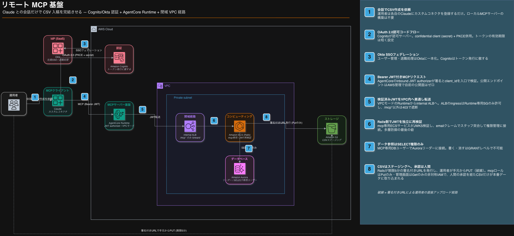

# AgentCore RuntimeでリモートMCPサーバーを作り手動運用を効率化しました

こんにちは、AIに仕事を振ってもらう側に回ることにしました。たろう眼鏡です。

レシチャレでは、運用者がキャンペーン設定用のCSVを作って管理画面からアップロードする作業が定常的に発生しています。
これを「Claude上で完結させる」ためのリモートMCP基盤をAWS上に構築し、先日リリースしたので選定理由やハマりどころなどを共有します。

セキュリティまわりの設計判断が多めの記事です。AIに社内システムを触らせるとき、どこまで触らせてどこで止めるか。この線引きの話を中心に書きます。

## なぜMCPが必要になったか

もともとの運用フローはこうです。運用者がまず管理画面でCSVの必須ヘッダーなどのフォーマットを確認し、Claudeで目当てのCSVを作成して、できたファイルを今度は管理画面を開いてアップロードする。
CSVを作ること自体はすでにClaudeに任せられていたのですが、その前後で管理画面との行き来が残っていました。しかもヘッダーの中には命名だけでは意味が取りづらいものもあり、どの列に何を入れるべきかを都度確かめる必要がありました。

ClaudeがMCP経由でフォーマットを自分で参照し、アップロードまでやってくれれば、この行き来がまるごと消えてClaudeの画面だけで完結します。おまけにMCPツールは「各ヘッダーにどんな値が入るか」というメタデータごと返せるので、人間が命名から推測していた列の意味を、AIは正確なコンテキストとして受け取れます。むしろ人間が管理画面を見るより間違えにくいんじゃないか、という仮説もありました。

ただし運用者はエンジニアではないので、ローカルにMCPサーバーを立ててもらう運用は各々のスキル・環境に依存してしまい現実的ではありません。各自のClaude（Web/デスクトップ）にカスタムコネクタを登録するだけで使える、リモートMCPサーバーが必要と考えました。

簡単にいうと、リモートMCPは「Claudeがインターネット越しに呼び出せる社内ツールの窓口」です。窓口なので、誰が入れるか（認証）と、入った人に何をさせても良いのか（権限）の設計が肝になります。

## 全体アーキテクチャ

経路の全体像はこうなりました。

認証はCognito（Okta連携）、MCPサーバーの実行基盤はAmazon Bedrock AgentCore Runtime、その先はVPC内のinternal ALBを経由して専用ECS上のRailsに届きます。MCPサーバー自体はPython製の薄い転送層で、ビジネスロジックと権限管理は全てアプリサーバー側に寄せています。

ポイントは、認証がAgentCoreの手前で完結して、検証済みのJWTがそのままRailsまで素通しで届くことです。Rails側でも同じJWTを独立に検証するので、途中のどれか1つの層が破られても、それだけでは最後まで突破できません。

## AIの暴走を止めるためのガードレール

AIに社内データを触らせる上でいちばん考えたのがここです。LLMは悪意がなくても間違えます。「間違ったSQLを実行する」「間違ったデータを本番に書き込む」が構造的に起こり得ない形にしておく必要がありました。

ガードレールは2本立てです。

### 読み取りはSELECT権限だけのDBユーザーに限定する
MCP経由のデータ参照用に専用のDBユーザーを発行し、付与したのはSELECT権限のみ。接続先もAuroraのリーダーインスタンスです。Claudeがどれだけ暴走しても、DBに対してできるのは「読む」だけで、書く・消す・ロックするは権限レベルで不可能です。
プロンプトやアプリコードの工夫で縛るのではなく、DBのGRANT文で縛る。LLM相手の制約は、LLMが読めない層に置くのが確実です。

### 書き込みは人間の承認を経由する
Claudeが作ったCSVは本番データに直接書き込まれません。MCPサーバー経由で取得した署名付きURLでS3のステージングバケットに置かれ、人間が管理画面でプレビューして承認ボタンを押したものだけが取り込まれます。

この承認フローはIAMでも強制しています。MCP側のタスクロールはS3バケットへのPutのみ、管理画面側のロールはGetのみという非対称な権限設計です。「AIが書いたものは、人間が確認して初めてデータになる」というワークフローを、運用ルールではなくインフラ層で表現しました。

## 各AWSサービスの選定理由とハマりどころ

経路の上から順に見ていきます。

### Cognito + Okta

弊社の社員認証基盤はOktaです。なので本命は「Oktaだけで完結する」構成で、OktaをそのままOAuthの認可サーバーとして使えれば登場人物を増やさずに済みます。
ただ、Okta上に認可サーバーを立てる機能は契約中のプランに含まれておらず、この用途のためだけのプラン変更もコスパ的に見合いませんでした。かといって認可サーバーの自前構築は過剰でした。トークン発行まわりを自前で面倒見ない、が今回の一貫した方針です。

というわけで半ばやむを得ず、マネージドな認可サーバーとしてCognitoを挟みました。CognitoのUser PoolにOktaをIdPとして連携し、ユーザー管理・退職処理はOktaに一本化、Cognitoは「OAuthのトークン発行」に徹する構成です。Claudeのコネクタ認証のためだけに別のユーザー管理が増えることもなく、退職者のアカウントをOktaで止めればMCPへのアクセスも同時に止まります。

トレードオフもあります。Okta連携でログインしたユーザーはCognitoのUser Poolにフェデレーテッドユーザーとして作られ、Okta側で権限を外してもUser Poolには残り続けるので、定期的な棚卸しは必要です。ただ、Oktaで権限がなくなれば新しい認証は通りませんし、トークンの有効期限も短く設定してあるので、手元に残ったトークンもすぐ失効します。クリティカルな問題ではないと判断しました。

### AgentCore Runtime

MCPサーバーの実行基盤はAmazon Bedrock AgentCore Runtimeにしました。簡単にいうと「MCPサーバーのコンテナを置くと、公開エンドポイントと認証とスケーリングを全部マネージドでやってくれるサービス」です。

最初の案はこれではありませんでした。Claudeは外部SaaSなので、どこかにインターネットから届く入口が要ります。素直に考えると公開ALB + ECSで、実際に初期案は「既存の公開ALBに相乗りして、WAFでAnthropicのegress IPだけ許可する」でした。ただこれ、公開面が1つ増える上に、IP許可リストをAnthropic側の変更に追従させ続ける運用が永遠に残ります。JWTの検証ミドルウェアも自前実装です。認証コードは正しく書けて当たり前、間違えると社内システムの入口が開く類のコードなので、できれば書きたくない。

AgentCoreはこの難所をほぼ全部引き受けてくれました。

- 入口はAWS管理の`bedrock-agentcore.*.amazonaws.com`で、自前の公開面はゼロ。攻撃面の管理をアカウントの外に出せるので、セキュリティレビューでの説明もしやすい
- inbound JWT authorizerにCognitoのdiscovery URLとclient_idを書くだけで、JWKS取得・署名検証・鍵ローテーション追従が入口で終わる。認証が「コード」ではなく「構成」になる
- VPCモードにするとRuntimeがprivate subnetにENIを生やすので、「入口はインターネット（認証済みのみ）、出口は閉域」という非対称な要件が設定ブロック1つで書ける
- 課金は処理中のvCPU/メモリ秒のみ。運用者の散発的な利用ではECS常駐より構造的に安く、初期フェーズのコストが安かった

### internal ALB + 専用ECS

AgentCoreから先はすべてVPC内です。internal ALBのingressはRuntime専用のセキュリティグループからのみ許可し、パスも`/mcp*`とヘルスチェック以外は403で落としています。internal ALBというだけでは、VPC内のどこからでも届いてしまうので、SG参照で送信元を1つに絞っています。

ECSはmcp専用サービスとして新設しました。既存の管理画面サービスに相乗りする選択肢もありましたが、分けたことで「MCPからのアクセス」をどの層でも識別できるようになります。DBユーザーもMCP専用に発行してあるので、スロークエリログやプロセスリストに並ぶクエリがどのサービス発かは、ユーザー名を見れば一発です。AI経由のクエリは人間の操作と違って量もパターンも予測しづらいので、「この負荷はMCPか、管理画面か」を即座に切り分けられる状態にしておくことは運用上助かります。

タスクロールも専用になるので、ガードレールの節で書いた「mcpはPutのみ・管理画面はGetのみ」の非対称IAMも、このサービス分離があって初めて書けた設計です。

### S3署名付きURL — LLMの物理制約が設計を決めた

CSVのアップロード経路は、当初「小さいファイルはツール引数で本文ごと渡すinline経路」と「署名付きURL経路」の2本立てで設計していました。最終的に署名付きURL1本に絞っています。

決め手はLLM特有の制約です。ツール引数に渡すCSV本文は、Claudeの出力トークンとして生成されます。つまり大きなファイルはそもそもこの経路で送れません。小さいファイル専用の経路を併存させるより、「`create_csv_upload_url`で期限5分の署名付きURLを取得して、手元からPUTする」の1本に揃えるほうが、説明も権限設計も単純でした。署名付きURLの発行はRailsの仕事で、MCPサーバー自体はS3に触りません。

### デプロイパイプライン — 「静かに無認証化するAPI」を封じ込める

デプロイはCodePipeline + CodeBuildで、mainへのマージ時にMCPサーバーのコードが変わっていたら自動でビルド・ECR push・Runtime更新まで走ります。構成自体は普通なので詳細は省きますが、1点だけセキュリティ的に見逃せない話があります。

Runtime更新に使う`update-agent-runtime`には部分更新がありません。呼び出しで指定しなかった設定ブロックは「現状維持」ではなく削除されます。つまり`--authorizer-configuration`を付け忘れたupdateが1回通るだけで、JWTの門番が外れてRuntimeがエラーも出さずに無認証公開になります。「全ブロックを必ず再指定すること」という手順書は、いつか必ず破られます。

なので手動デプロイを廃止して、手順ごとパイプラインに封じ込めました。buildspecは現行設定を全量取得して機械的に再指定するだけで、認証設定を「作る」コードを持ちません。更新後にはauthorizerやヘッダー設定が実値で残っているかを検証し、欠けていればビルドを赤にします。さらに手動CLI経由の抜け道に備えて、authorizerを含まない`UpdateAgentRuntime`呼び出しをCloudTrail + EventBridgeで検知して通知するルールも置きました。仮に全部すり抜けても、Rails側が同じJWTを独立に検証するので業務データには届きません。

## 実際に使うとこうなる

ビズ運用者から見える手順は「Claudeにコネクタを登録して、あとは話すだけ」です。

【スクショ: カスタムコネクタの接続画面。接続ボタンを押すとOktaのSSO画面に飛ぶ】

初回の接続でOktaのログイン画面に飛びます。既にOktaセッションがあれば無操作で通過するので、体感としてはボタンを1回押すだけです。

【スクショ: Claudeとの会話でCSVの内容を相談しながら作っているところ】

あとは普通の会話です。「来週のキャンペーン設定のCSVを作って」と依頼すると、ClaudeがMCPツールでCSVフォーマットの定義やラベル一覧を参照しながらCSVを組み立てます。各ヘッダーにどんな値が入るかのメタデータも一緒に返ってくるので、人間がフォーマット仕様を説明してあげる必要はありません。

【スクショ: ツール呼び出しで署名付きURLが発行され、アップロードが完了したところ】

内容が固まったらアップロード用の署名付きURLを取得して、CSVをステージングに配置。ここから先は人間のターンで、管理画面のプレビューで内容を確認し、承認して初めて本番データに取り込まれます。

## 今後の展望

基盤はdev/stg/prodの全環境にリリース済みです。現在の権限は「DBはSELECTのみ、書き込みは承認画面経由のみ」という最も保守的な設定から始めています。

ただ、使ってもらうと当然「この更新はClaudeから直接やらせてほしい」という声が出てきます。いまチームで進めているのが、MCPからの書き込みを許可するためのルール設計です。どの操作なら承認画面を経由せずに書き込みを許すか、その場合に何をログとして残すか。SELECT権限だけ・承認画面必須という現在の制約を、「なぜそれで安全か」の根拠を引き直しながら少しずつ緩めていく予定です。

ガードレールは最初に最も固く作っておいたので、緩める方向の変更は「どこまで信頼するか」の意思決定だけで済みます。逆向き（緩い状態から締める）だったら大変だったと思います。

## まとめ

Claudeから社内システムを操作するリモートMCP基盤を、Cognito + Okta認証とAgentCore Runtimeで構築しました。認証はマネージドの構成に寄せ、AIの権限はDBのGRANTとIAMの非対称で縛り、書き込みは人間の承認を必ず経由させる。AIに渡す権限の線引きをプロンプトではなくインフラ層で表現する、というのが今回の一番の学びです。

Cognito × Claudeの罠2つ（secret必須・phone scope）は、これからリモートMCPを作る方が同じ場所で丸一日溶かさないよう、ここに置いておきます。

Happy MCP building! 🚀
